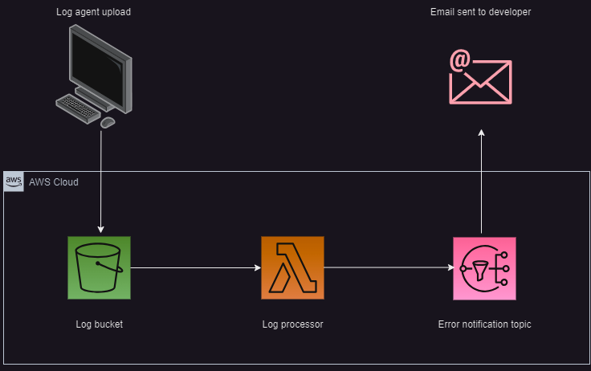

# AWS_log_notifications
Here is my solution for sending email notification everytime a runtime of a 
(Python) program logs an error. Let's say you are developing some program, which
runs periodically processing batches of data, the program is immature and in 
some places of the program happens some error handling, you would like to
eliminate in the future. You can be one step ahead and collect logs from
multiple environments by uplloading them in S3 bucket, extracting just the error
chunks from the log and sending these to the developer. Below is the schema of
the idea

## Creating IAM User
For the purposes of this solution, you may create an IAM user, whose only
permission is to upload objects in specific folder of some S3 bucket. The access
keys of this users will be used in all the log agent programs, which you can run
everytime your deployed program finished running, and you would like to collect 
the logs. 

## Creating a lambda function
The idea works perfectly for a lambda function (log_processor) - each upload 
into the S3 bucket invokes a lambda function, which gets the uploaded object, 
extracts the parts with information about errors and publishes a SNS
notification containing the name of the log file and all the chunks of the logs,
where error was handled.

## SNS subscription
A developer can be subscribed to this topic and can be one step ahead of the 
customer by getting email on errors from any such program and can quickly 
analyze the problem and implement a fix to improve robustness of their program.